# Character Recognition using Convolutional Autoencoder

This project implements a Convolutional Autoencoder (ConvAE) for character recognition/reconstruction using the MNIST dataset. The model learns to compress images into a low-dimensional latent space and then reconstruct them.

## Project Structure

- `ConAE.ipynb`: The main Jupyter Notebook containing the data loading, model definition, training loop, and visualization code.
- `extract_images.py`: A script to extract images generated by the notebook.
- `output_*.png`: Extracted images visualizing the data, training progress, and latent space.

## Model Architecture

The Convolutional Autoencoder consists of:

- **Encoder**: Compresses the 28x28 input image into a latent vector (embedding_dim=3).
  - Conv2d layers with ReLU activations and MaxPool2d.
  - Flatten and Linear layer to the embedding dimension.
- **Decoder**: Reconstructs the image from the latent vector.
  - Linear layer and Unflatten.
  - ConvTranspose2d layers with ReLU activations.
  - Final Conv2d layer with Sigmoid activation to output pixel values between 0 and 1.

## Training

The model is trained using:
- **Loss Function**: BCELoss (Binary Cross Entropy Loss) + L2 Regularization.
- **Optimizer**: Adam with learning rate 0.001.

## Visualizations

Below are the images produced during the execution of the notebook.

### Data Visualization
Initial data exploration and sample images.
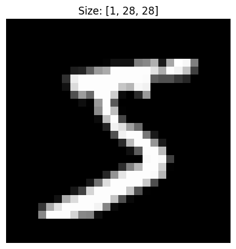

### Training Loss
Plot of the training loss over epochs.
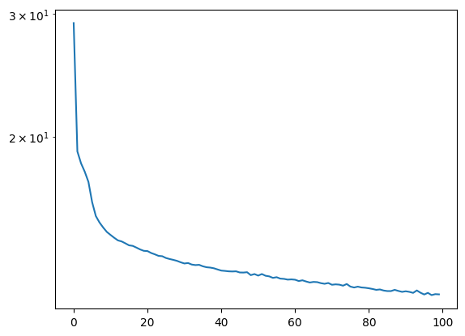

### Latent Space Visualization
Visualizing the learned features in the latent space.
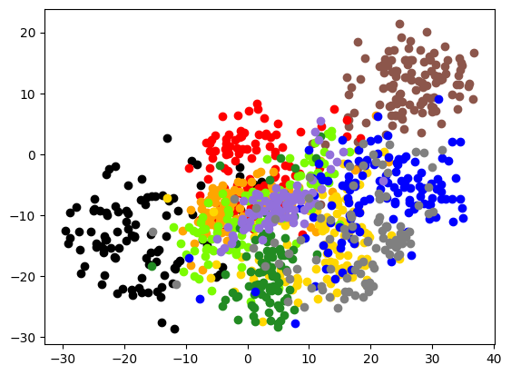
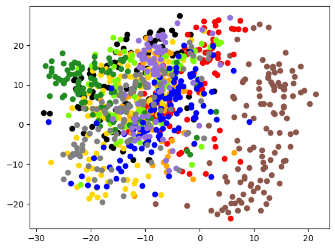
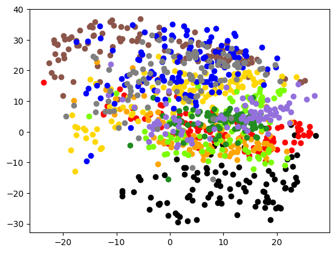
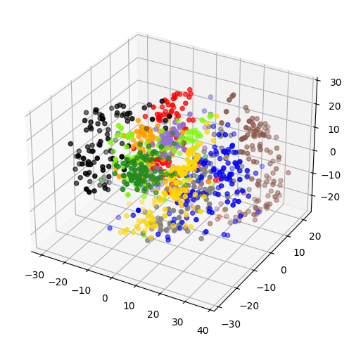

### Reconstructions and Training Progress
Various outputs showing the model's performance and training progression.

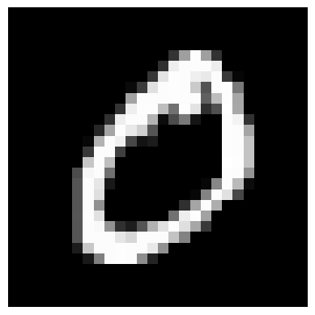
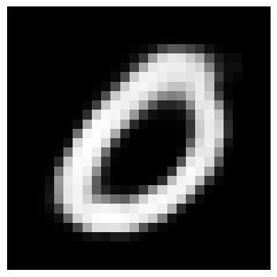
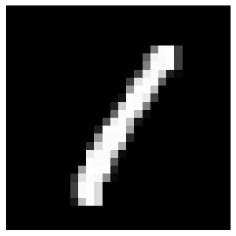
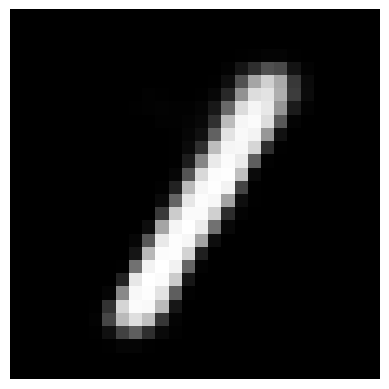
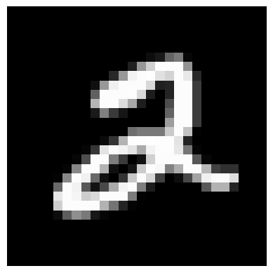
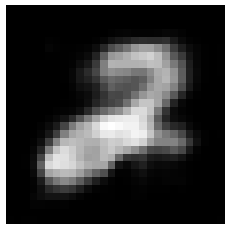
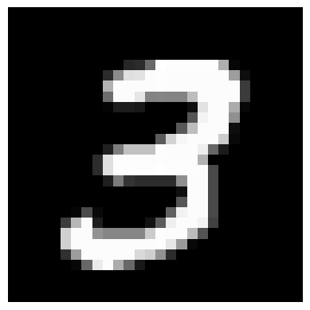
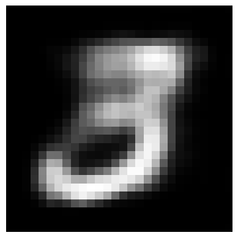
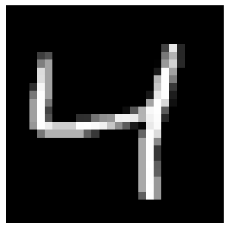
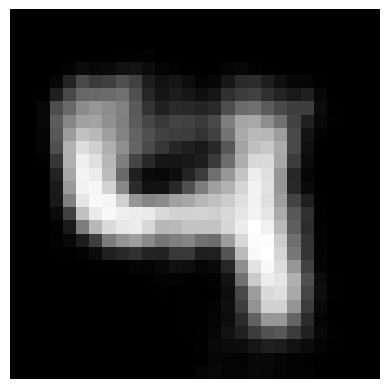
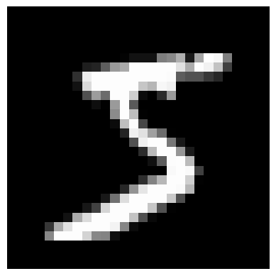

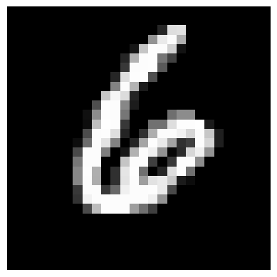
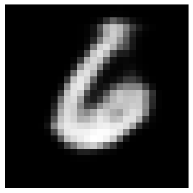
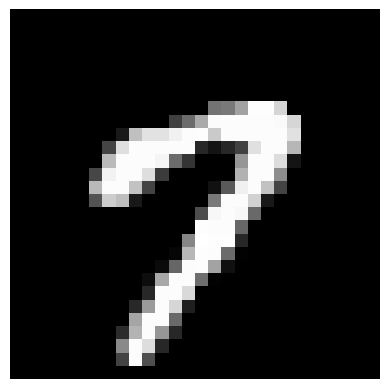
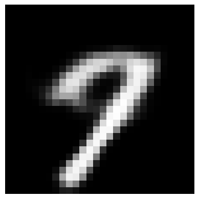
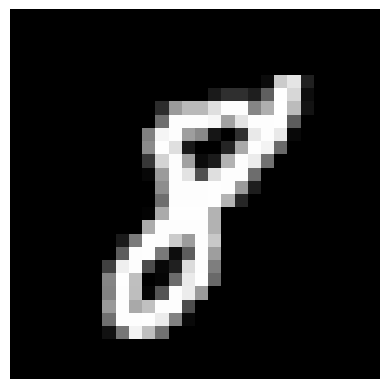
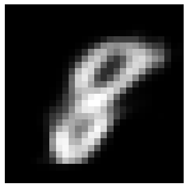
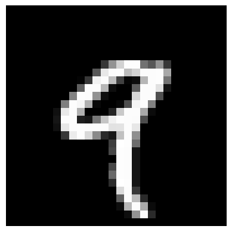
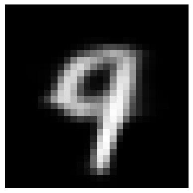
